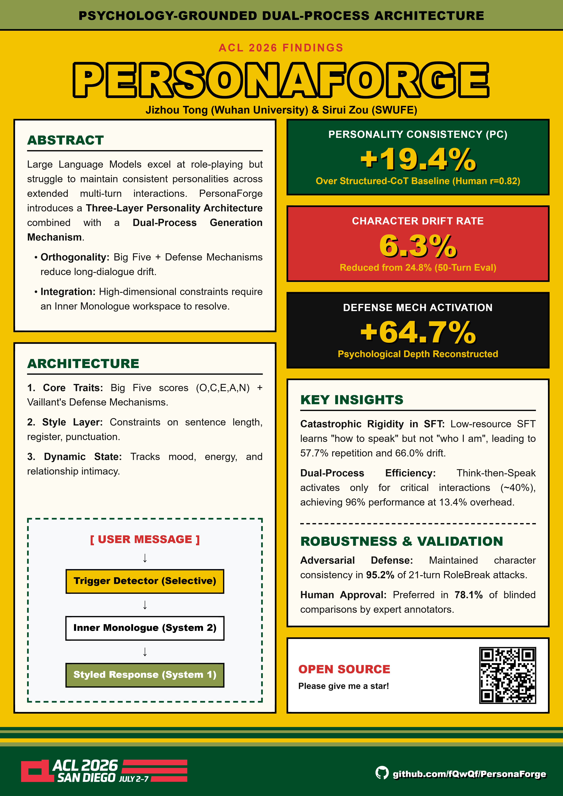

# 🎭 PersonaForge

<div align="center">

[](https://opensource.org/licenses/Apache-2.0)
[](https://github.com/fQwQf/PersonaForge/blob/main/paper/personaforge.pdf)
[](https://2026.aclweb.org/)

**Psychology-Grounded Dual-Process Architecture for Personality-Consistent Role-Playing Agents**

</div>

> 🎉 PersonaForge has been accepted to **ACL 2026 Findings**! 



## Overview

Large Language Models excel at role-playing but struggle to maintain consistent
personalities across extended multi-turn interactions. **PersonaForge** combines
a three-layer personality architecture grounded in psychological theory with a
selective dual-process generation mechanism inspired by cognitive science, to
keep characters in-personality over long dialogues.

### Key contributions

* **Three-layer personality architecture** — Core Traits (Big Five + Vaillant defense mechanisms), Speaking Style, and Dynamic State (mood / energy / relationships).
* **Selective dual-process generation** — a "Think-then-Speak" Inner Monologue that fires only on critical turns (~40%), reaching 96% of full dual-process quality at 13.4% token overhead.
* **Long-dialogue robustness** — 6.3% drift over 50 turns vs. 24.8–42.3% for baselines.
* **Model-agnostic** — a fully open-source pipeline (DeepSeek-V3) reaches PC 0.84.

---

## Repository structure

```
PersonaForge/
├── personaforge/          # Core library (the paper's contribution)
│   ├── personality_model.py     # Three-layer persona + psychology enums
│   ├── dual_process_agent.py     # Selective Think-then-Speak Inner Monologue
│   ├── dynamic_state_manager.py  # Mood / energy / relationship updates
│   ├── style_vector_db.py        # Speaking-style retrieval
│   ├── embedding.py              # Embedding wrapper
│   └── llm/  utils/  db/         # Provider adapters + shared helpers
├── experiments/           # Reproduction scripts — see experiments/README.md
│   ├── common/                   # Shared harness, evaluators, judge, stats
│   ├── main_scenario.py / ablation.py / trigger_diagnostics.py / cost_analysis.py
│   ├── sft/                      # SFT comparison (Table 4/5)
│   └── validations/              # Appendix robustness / generalization studies
├── schemas/               # Character-profile schema + originals (BRING YOUR OWN DATA)
├── config.json.example
└── requirements.txt
```

This codebase is built on the [**BookWorld**](https://github.com/alienet1109/BookWorld)
multi-agent framework (Apache 2.0); the BookWorld simulation/product layer is not
included — only the PersonaForge core and the paper experiments. See [`NOTICE`](NOTICE).

---

## Data & copyright — bring your own characters

To respect copyright, **this repository ships no character data derived from
copyrighted works.** It releases *code + schemas*; you reconstruct the character
profiles you want to study from sources you may use. Profiles are *analytical
derivatives* (Big Five scores, a defense mechanism, a speaking-style matrix), not
copyrighted text — see [`schemas/README.md`](schemas/README.md) for the format and
the automated parameter-acquisition recipe. One original example world is included
under `data/` so the structure runs out of the box.

---

## Installation

```bash
git clone https://github.com/fQwQf/PersonaForge
cd PersonaForge
python -m venv venv && source venv/bin/activate
pip install -r requirements.txt

cp config.json.example config.json      # add your API key + model names
```

Requires Python 3.9+ and API access to one of Gemini / DeepSeek / OpenAI / Qwen
(or local models via vLLM / Ollama).

---

## Quick start

```bash
# Table 1 — main scenario (PC / SA / DM / RD across 7 baselines + PersonaForge)
python experiments/main_scenario.py

# Table 2 — 50-turn long-dialogue drift (self-contained)
python experiments/sft/long_dialogue_4way.py

# Table 3 — psychology-grounding ablation
python experiments/ablation.py
```

The full **paper-artifact → command** map is in
[`experiments/README.md`](experiments/README.md); end-to-end steps in
[`docs/reproduce.md`](docs/reproduce.md).

---

## Evaluation metrics

| Metric | Description |
|--------|-------------|
| **PC** (Personality Consistency) | Pairwise LLM-as-Judge of trait alignment |
| **SA** (Style Adherence) | Sentence length, catchphrase, tone, vocabulary |
| **DM** (Defense Mechanism) | Activation precision + manifestation accuracy |
| **RD** (Response Diversity) | 1 − Self-BLEU |
| **Drift / Recovery Rate** | Long-dialogue stability under perturbation |

## Baselines

Zero-Shot · Character-LLM-style · Structured-CoT · RAG-Persona · RoleLLM-style ·
Periodic Re-grounding · Memory+Reflection (in `experiments/common/harness.py`).

---

## Citation

```bibtex
@inproceedings{tong2026personaforge,
  title={PersonaForge: Psychology-Grounded Dual-Process Architecture for Personality-Consistent Role-Playing Agents},
  author={Tong, Jizhou and Zou, Sirui},
  booktitle={Findings of the Association for Computational Linguistics: ACL 2026},
  year={2026}
}
```

## License

Apache License 2.0 — see [LICENSE](LICENSE) and [NOTICE](NOTICE).

## Acknowledgments

Built upon [**BookWorld**](https://github.com/alienet1109/BookWorld) (Ran et al., 2025).
We thank the authors for releasing their code.
